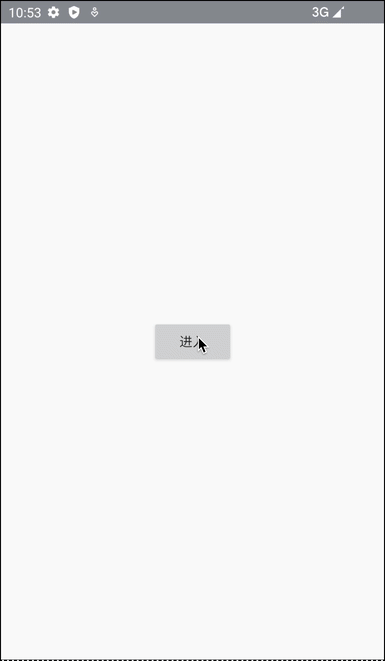
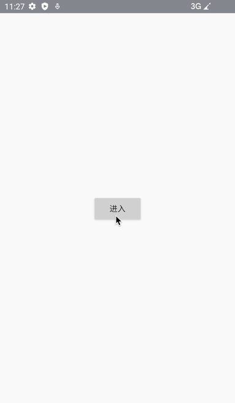

# CustomizeBottomWindow
使用WindowManager 定义一个挂靠悬浮框

demo东西比较多，是从自己项目里摘录出来的，扩展了MagicIndicator

核心类：AffiliatedBottomWindow


# 1.0 效果图


# 2、前言
1、页面由 MagicIndicator + ViewPager2 + Fragment 实现；

2、下拉框是基于WindowManager实现；

3、我使用PopupWindow实现下拉框时，发现一个问题，PopupWindow 在窗口显示的情况下，无法直接从外部修改布局，必须先dismiss；

PopupWindow源码：

```
public void setContentView(View contentView) {
    if (isShowing()) {
        return;
    }
 
    ... ...
}
 
 
public void showAsDropDown(View anchor, int xoff, int yoff, int gravity) {
    if (isShowing() || !hasContentView()) {
        return;
    }
    ... ...
}
```

4、如果先dismiss再添加，属于重新创建布局，切换生硬，会出现闪烁，影响用户体验，就像这样；


那就没办法了，自己实现；

观摩PopupWindow源码发现它是基于windowManager实现的，照葫芦画瓢，自定义一个

# 3、自定义下拉框

*AffiliatedBottomWindow*

```
package com.example.myapplication.common;
 
import android.animation.Animator;
import android.animation.AnimatorListenerAdapter;
import android.animation.ValueAnimator;
import android.annotation.SuppressLint;
import android.content.Context;
import android.graphics.PixelFormat;
import android.view.Gravity;
import android.view.View;
import android.view.ViewGroup;
import android.view.WindowManager;
 
import androidx.annotation.NonNull;
 
import com.example.myapplication.util.BarUtils;
import com.example.myapplication.util.CustomizeUtils;
import com.example.myapplication.util.ScreenUtils;
 
 
/**
 * 挂靠在某个view下面的悬浮窗
 * <p>
 * 和PopupWindow一样都是基于WindowManager实现的；
 * <p>
 *
 * 和PopupWindow区别：
 * PopupWindow 在窗口显示的情况下，无法直接从外部修改布局，必须先dismiss，
 * 再重新创建，切换会出现闪烁，用户体验差；
 * <p>
 * PopupWindow源码：
 * public void setContentView(View contentView) {
 *      if (isShowing()) {
 *          return;
 *      }
 *      ... ...
 * }
 *
 * <p>
 * 为了避免这种闪烁，基于WindowManager写了这个 AffiliatedBottomWindow 底部挂靠悬浮框；
 * <p>
 *
 *
 * 注意：单例，使用完成后一定要清空，不然无法创建实例 if (instance == null) {}
 *     public void clear() {
 *         instance = null;
 *     }
 */
public class AffiliatedBottomWindow {
 
    private final Context context;
 
    private static CustomizeUtils.AntiShake antiShake;
 
    private WindowManager windowManager;
 
    @SuppressLint("StaticFieldLeak")
    private static AffiliatedBottomWindow instance;
 
    // 根view
    @SuppressLint("StaticFieldLeak")
    private static ViewGroup rootView;
 
    // 根view中的子view
    private ViewGroup rootChildView;
 
    // true：使用 根view中的子view 作为内容布局的容器
    private boolean useRootChildView = false;
 
    // 显示/隐藏 过渡动画时长
    public static int animatorDuration = 200;
 
    private WindowManager.LayoutParams windowLayoutParams;
 
    private AffiliatedBottomWindow(Context context) {
        this.context = context;
        createWindowManager();
        antiShake = new CustomizeUtils.AntiShake(500);
    }
 
    public WindowManager getWindowManager() {
        return windowManager;
    }
 
    public void setWindowManager(WindowManager windowManager) {
        this.windowManager = windowManager;
    }
 
    public AffiliatedBottomWindow getInstance() {
        return instance;
    }
 
    public WindowManager.LayoutParams getWindowLayoutParams() {
        return windowLayoutParams;
    }
 
    public void setWindowLayoutParams(WindowManager.LayoutParams windowLayoutParams) {
        this.windowLayoutParams = windowLayoutParams;
    }
 
    public ViewGroup getRootView() {
        return rootView;
    }
 
    public void setRootView(ViewGroup rootView) {
        AffiliatedBottomWindow.rootView = rootView;
 
        // 初始化隐藏布局
        AffiliatedBottomWindow.rootView.setVisibility(View.GONE);
    }
 
    public boolean isUseRootChildView() {
        return useRootChildView;
    }
 
    public void setUseRootChildView(boolean useRootChildView) {
        this.useRootChildView = useRootChildView;
    }
 
    // 显示 和 隐藏 过渡透明度动画
    public static void alphaAnimation(boolean show) {
        if (antiShake.isFastClick()) {
            ValueAnimator animator;
            if (show) {
                if (rootView.getVisibility() == View.VISIBLE) {
                    return;
                }
                rootView.setAlpha(0);
                rootView.setVisibility(View.VISIBLE);
 
                //显示
                animator = ValueAnimator.ofFloat(0f, 1f);
 
                animator.addUpdateListener(new ValueAnimator.AnimatorUpdateListener() {
                    @Override
                    public void onAnimationUpdate(@NonNull ValueAnimator animation) {
                        float progress = (float) animation.getAnimatedValue();
                        rootView.setAlpha(progress);
                    }
                });
                animator.setDuration(animatorDuration);
                animator.start();
            } else {
                if (rootView.getVisibility() == View.GONE) {
                    return;
                }
 
                //隐藏
                animator = ValueAnimator.ofFloat(1f, 0f);
 
                animator.addUpdateListener(new ValueAnimator.AnimatorUpdateListener() {
                    @Override
                    public void onAnimationUpdate(@NonNull ValueAnimator animation) {
                        float progress = (float) animation.getAnimatedValue();
                        rootView.setAlpha(progress);
                    }
                });
 
                animator.addListener(new AnimatorListenerAdapter() {
 
                    @Override
                    public void onAnimationEnd(Animator animation) {
                        super.onAnimationEnd(animation);
                        rootView.setVisibility(View.GONE);
                    }
 
                });
                animator.setDuration(animatorDuration);
                animator.start();
            }
        }
 
    }
 
    /**
     * 内容布局插入到 根View中
     *
     * @param context
     * @param rootView       根布局
     * @param affiliatedView 挂靠的View，悬浮框会出现在这个View下面
     */
    public static AffiliatedBottomWindow createInstance(Context context,
                                                        ViewGroup rootView,
                                                        View affiliatedView) {
        if (instance == null) {
            instance = new AffiliatedBottomWindow(context);
 
            // 先设置根view
            instance.setRootView(rootView);
 
            // 再设置挂靠view，顺序不能乱
            instance.setAffiliatedView(affiliatedView);
        }
        return instance;
    }
 
    /**
     * 内容布局插入到 根View中的 子View中
     *
     * @param context
     * @param rootView          根布局
     * @param affiliatedView    挂靠的View，悬浮框会出现在这个View下面
     * @param rootChildView     根view中的子view
     * @param useChildContainer 是否将 根view中的子view 作为内容布局的容器
     */
    public static AffiliatedBottomWindow createInstance(Context context,
                                                        ViewGroup rootView,
                                                        View affiliatedView,
                                                        ViewGroup rootChildView,
                                                        boolean useChildContainer) {
        if (instance == null) {
            instance = new AffiliatedBottomWindow(context);
            instance.setUseRootChildView(useChildContainer);
            instance.setRootChildView(rootChildView);
 
            // 先设置根view
            instance.setRootView(rootView);
 
            // 再设置挂靠view，顺序不能乱
            instance.setAffiliatedView(affiliatedView);
 
        }
        return instance;
    }
 
    public void setAffiliatedView(View affiliatedView) {
        // 设置悬浮框宽/高
        windowLayoutParams.width = affiliatedView.getWidth();
 
        // 剩余空间高度
        windowLayoutParams.height = ScreenUtils.getScreenHeight(context) - affiliatedView.getBottom();
 
        // 设置悬浮框位置
        windowLayoutParams.gravity = Gravity.TOP;
 
        // 减去状态栏高度，沉浸式布局，
        // 如果不是沉浸式布局，扩展重写此方法
        windowLayoutParams.y = affiliatedView.getBottom() - BarUtils.getStatusBarHeight(context);
 
        // 显示，当前根视图隐藏了，所以不显示
        windowManager.addView(rootView, windowLayoutParams);
    }
 
    public void setRootChildView(ViewGroup rootChildView) {
        this.rootChildView = rootChildView;
    }
 
    private void createWindowManager() {
        if (windowManager != null) {
            return;
        }
 
        // 创建 windowManager对象
        windowManager = (WindowManager) context.getSystemService(Context.WINDOW_SERVICE);
 
        // 创建布局参数
        windowLayoutParams = new WindowManager.LayoutParams();
 
        // 设置窗口类型
        windowLayoutParams.type = WindowManager.LayoutParams.TYPE_APPLICATION;
 
        // 设置悬浮框不可触摸，默认接收事件，会导致底层view，接收不到事件
        windowLayoutParams.flags = WindowManager.LayoutParams.FLAG_NOT_TOUCH_MODAL
                | WindowManager.LayoutParams.FLAG_NOT_FOCUSABLE;
 
        // 背景颜色，设置为透明
        windowLayoutParams.format = PixelFormat.TRANSPARENT;
    }
 
    // 插入布局
    public void insertViewLayout(View view) {
        if (useRootChildView) {
            if (rootChildView.getChildCount() == 0) {
                rootChildView.addView(view);
            } else {
                rootChildView.removeAllViews();
                rootChildView.addView(view);
            }
        } else {
            if (rootView.getChildCount() == 0) {
                rootView.addView(view);
            } else {
                rootView.removeAllViews();
                rootView.addView(view);
            }
        }
        alphaAnimation(true);
    }
 
    // 隐藏窗口
    public static void dismiss() {
        alphaAnimation(false);
    }
 
    // 单例，使用完成后一定要清空
    // 不然 无法创建实例 if (instance == null) {}
    public void clear() {
        instance = null;
    }
}
```
